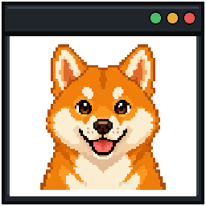
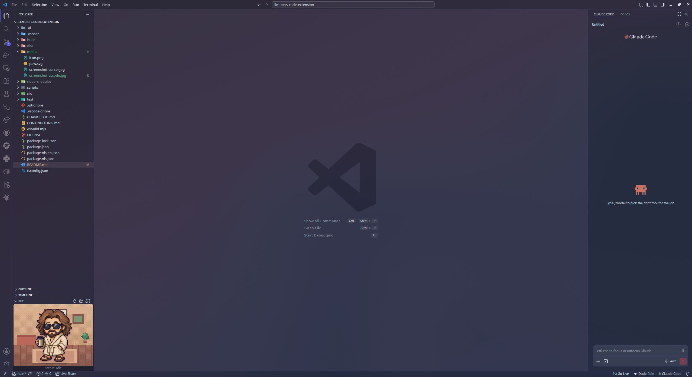
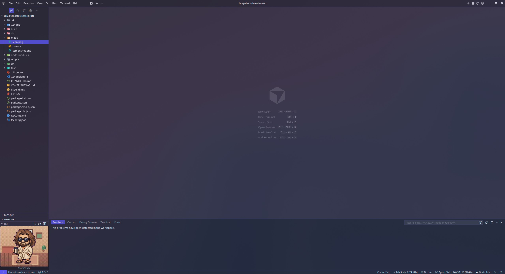

<div align="center">
  
  <h1>LLM Pets</h1>
  <p><strong>Codex-format pets in VS Code (Cursor-compatible) and in the Linux terminal.</strong></p>
  <p><code>llm-pets</code></p>
</div>

<p align="center">
  <a href="#preview">Preview</a> ·
  <a href="#cli">CLI</a> ·
  <a href="#extension">Extension</a> ·
  <a href="#linux-terminal">Linux terminal</a> ·
  <a href="#pet-format">Pet format</a>
</p>

## Preview

| VS Code | Cursor |
| :-----: | :----: |
|  |  |

Pets are not bundled. The CLI writes `~/.pets/<slug>/`. The extension and the Linux renderer look there first, then fall back to Codex home (`$CODEX_HOME/pets` or `~/.codex/pets`). Existing pets such as Dude keep working without copying.

```text
packages/llm-pets-extension   VS Code extension (VSIX; Cursor-compatible)
packages/llm-pets-terminal    Linux terminal daemon (TypeScript)
packages/llm-pets-cli         llm-pets CLI
hooks/                        Shared hook protocol (internal)
```

> [!IMPORTANT]
> Install at least one compatible pet under `~/.pets` (or keep one under Codex home) before using the viewer or the terminal renderer.

## Setup

From the repo root, with [pnpm](https://pnpm.io/) `11.22.0`:

```sh
pnpm install
pnpm test
pnpm llm-pets --help
```

If `pnpm llm-pets --help` prints pnpm's help instead of the CLI, use `pnpm llm-pets -- --help`.

---

## CLI

`packages/llm-pets-cli`. Bin name **`llm-pets`** (plural). The terminal daemon is **`llm-pet`** (singular).

```sh
pnpm llm-pets get <slug>
pnpm llm-pets get <slug> --registry petdex
pnpm llm-pets get <slug> --registry https://example.com --overwrite
pnpm llm-pets install extension
pnpm llm-pets install terminal
```

`get` writes `~/.pets/<slug>/pet.json` plus a spritesheet. It refuses to overwrite unless `--overwrite`. `--pets-dir` overrides the destination root.

Default registry is [CodexPetHub](https://codexpethub.com) (`codexpethub.install.v1` manifests). `--registry petdex` uses `https://petdex.dev/api/manifest`. Any other https base URL is tried as an install-manifest host, then as a petdex-style gallery.

`install extension` packages the VSIX and installs it into `code` (and `cursor` if it is on PATH). `install terminal` compiles `llm-pets-terminal` then runs `node dist/main.js install`.

After `pnpm compile`, the bin is `packages/llm-pets-cli/dist/cli.js`.

---

## Extension

`packages/llm-pets-extension`. Displays locally installed pets in a **PET** panel. Optional user-level hooks drive animation from Cursor, Codex, or Claude.

### Features

- Loads `~/.pets`, then `CODEX_HOME/pets` or `~/.codex/pets`
- Own **PET** Panel view, resizes with the editor
- Twenty original pixel-art Canvas backgrounds (no image files bundled)
- PNG, WebP, and GIF sprite sheets
- `idle`, `running`, `waiting`, `review`, and `failed` states
- v2 look-direction frames toward the pointer while idle
- Remembers the selected pet; reloads on file changes
- Status bar shows the active pet and state
- Optional Cursor / Codex / Claude hooks (default is manual commands)
- Aggregates activity from multiple agent sessions
- English UI, no telemetry

### Requirements

- Visual Studio Code 1.125 or later (Cursor-compatible)
- At least one compatible pet under `~/.pets` or Codex home

### Install

Not published on the Marketplace. From this repo:

```sh
pnpm llm-pets install extension
```

Or Command Palette → **Extensions: Install from VSIX...** and pick the file under `packages/llm-pets-extension/build/`.

From source: `pnpm compile`, then F5 in this workspace (launch config points at the extension package).

### Getting started

1. `pnpm llm-pets get <slug>` (or keep a pet under `~/.codex/pets/<pet-id>`).
2. Open a folder in VS Code (or Cursor).
3. Open **PET** from the Panel tabs, or **View: Open View** → **PET**.
4. Right-click inside the PET view to change the pet, background, size, or animation speed.

Left-click the pet (or focus it and press Enter/Space) for a short wave. Repeated activation is throttled; the pet then returns to the latest manual or hook state.

To sit beside the Terminal, drag the **PET** view header onto the right side of the Terminal panel. VS Code remembers that layout. Size is `pet.scale`; **Auto** fits the available area.

If `pet.petDirectory` is set, that directory is the only one scanned. Otherwise `~/.pets` wins over Codex home when the same id exists in both. This project does not invent `~/.cursor/pets`.

<details>
<summary>Bundled backgrounds</summary>

Arcade, Autumn Forest, Blue Sky, Cozy Office, Engineering Office, Grassland, Japanese Festival, Japanese Room, Living Room, Night Camp, Night City, Outer Space, Rainy Cafe, Secret Treehouse, Server Room, Snowy Cabin, Sunset Overlook, Terminal, Tropical Beach, Underwater. **None** uses the theme background. **Custom Image** is a local PNG, WebP, or GIF up to 20 MB.

</details>

### Agent integration

Default mode is `manual`. Settings: **LLM Pets: Integration Mode** (`manual` or `hooks`) and **LLM Pets: Hook Provider** (`cursor`, `codex`, or `claude`). Cursor has no waiting hook; Codex and Claude map `PermissionRequest` to waiting.

When a pet is visible and hooks are not configured, the PET view offers **Enable integration**. That merges this extension’s handlers into the selected agent’s user hook file, installs the shared `hook.cjs` at `~/.local/share/llm-pets/hook.cjs`, and sets mode to `hooks`. Installing one provider removes this extension’s handlers from the other two. Unrelated third-party hooks stay. The script is fail-open: write an event file, exit 0. It never denies, blocks, or rewrites tool calls.

| Provider | Configuration file        |
| -------- | ------------------------- |
| Cursor   | `~/.cursor/hooks.json`    |
| Codex    | `~/.codex/hooks.json`     |
| Claude   | `~/.claude/settings.json` |

```text
sessionStart / SessionStart                         -> idle
beforeSubmitPrompt / UserPromptSubmit,
preToolUse / PreToolUse / PostToolUse,
afterAgentThought                                   -> running
PermissionRequest                                   -> waiting
postToolUseFailure / PostToolUseFailure             -> failed (hold ~5s, then idle)
stop / Stop, afterAgentResponse, sessionEnd         -> review (hold ~3s, then idle)
```

Several sessions: `failed > waiting > running > review > idle`. Event files go to `~/.local/state/llm-pets/events/`. Stale or invalid files are ignored. **LLM Pets: Uninstall Hooks Integration** removes only this extension’s handlers.

### Commands and settings

Command Palette: search **LLM Pets**. Viewer: Change Pet / Background / Animation Speed / Pet Size, Refresh Pets, Open Pets Directory, Open Pet Preview. Manual states: Idle, Running, Waiting, Review, Failed. Hooks: Install, Uninstall, Open Hooks Configuration.

| Setting                                | Default     | Description                                      |
| -------------------------------------- | ----------- | ------------------------------------------------ |
| `pet.enabled`                    | `true`      | Enables the Pet Viewer                           |
| `pet.petDirectory`               | empty       | Overrides the default pets directories           |
| `pet.scale`                      | `1`         | Size 0.25–3, or `auto`                           |
| `pet.background`                 | `grassland` | Bundled Canvas background, `custom`, or `none`   |
| `pet.customBackground.imagePath` | empty       | Local PNG, WebP, or GIF (20 MB max)              |
| `pet.customBackground.opacity`   | `1`         | 0–1                                              |
| `pet.animationSpeed`             | `1`         | 0.25–3                                           |
| `pet.pauseWhenHidden`            | `true`      | Pause while the view is hidden                   |
| `pet.watchPetDirectory`          | `true`      | Reload after file changes                        |
| `pet.integrationMode`            | `manual`    | `manual` or `hooks`                              |
| `pet.hookProvider`               | `cursor`    | `cursor`, `codex`, or `claude`                   |

### Troubleshooting

No pet: **LLM Pets: Open Pets Directory**, check `pet.json` and `spritesheetPath`, then **Output: LLM Pets**.

No agent reaction: `integrationMode` is `hooks`, `hookProvider` matches the agent, **Open Hooks Configuration** shows this extension’s command, reload after hook edits, reinstall if the extension path changed.

Size: `pet.scale` or right-click → **Change Pet Size** → **Auto**.

### Privacy

No telemetry. Pet files, hook events, and workspace paths are not sent to an extension-owned server. Webview roots are the extension and resolved pet directories. Sprite paths cannot leave their pet folder. Hook files change only after an explicit install or uninstall.

---

## Linux terminal

`packages/llm-pets-terminal`. An animated sprite in the same Linux terminal as **Codex** or **Claude Code**. It idles while you think, runs while the agent works, waits on permission, and erases itself when the agent exits.

```
agent hook  ->  ~/.local/state/llm-pets/events/*.json  ->  renderer  ->  your terminal
```

| event | state |
| --- | --- |
| `SessionStart` | idle |
| `UserPromptSubmit`, `PreToolUse`, `PostToolUse`, `PreCompact`, `SubagentStop` | running |
| `PermissionRequest`, `Notification` | waiting |
| `PostToolUseFailure` | failed, then idle after 5s |
| `Stop`, `SessionEnd` | review, then idle after 3s |

### Backends

Picked automatically.

**kitty** — kitty graphics protocol, real alpha. Used when the terminal supports it and you are not inside tmux.

**blocks** — half-block truecolor cells. Dedicated tmux pane uses these. `--backend blocks` forces a corner overlay. Auto-select never overlays inside tmux.

**pane** — the same half-block cells in a dedicated tmux pane. `llm-pet pane`, or started automatically when `codex`/`claude` run inside tmux.

Sixel was tried and dropped: in Konsole a Sixel over a Sixel fills untouched pixels with black, so transparent animation is impossible here.

The daemon writes to a tty the agent owns, so it never reads that tty. Overlay open is write-only (`O_WRONLY | O_NOCTTY`). Capability detection runs from `llm-pet wrap` (`llm-pet probe`) before the agent starts, then caches per terminal type. Without a cache it uses environment heuristics (`KITTY_WINDOW_ID`, `TERM`, Konsole >= 22.04, …). Size comes from ioctl on the overlay fd, not stdout.

### Install

Node.js 24+, pnpm `11.22.0`. Native builds: `sharp` (sprites) and `koffi` (flock / `TIOCGWINSZ`).

```sh
pnpm llm-pets install terminal
```

That compiles the renderer and links three files, leaving this checkout as the source of truth:

```
~/.local/bin/llm-pet              -> dist/main.js
~/.local/share/llm-pets/hook.cjs  -> hooks/hook.cjs
~/.bashrc.d/llm-pets.sh           wraps `codex` / `claude` via `llm-pet wrap`
```

Then register the hook with your agents. **Claude Code** (`~/.claude/settings.json`) — for each of `SessionStart`, `UserPromptSubmit`, `PreToolUse`, `PostToolUse`, `Notification`, `SubagentStop`, `PreCompact`, `Stop`, `SessionEnd`:

```json
{
  "hooks": {
    "PreToolUse": [
      {
        "hooks": [
          {
            "type": "command",
            "command": "node ~/.local/share/llm-pets/hook.cjs 2>/dev/null || true",
            "timeout": 5,
            "async": true
          }
        ]
      }
    ]
  }
}
```

`async` keeps the hook off the critical path. `|| true` means a broken pet cannot block the agent. **Codex** (`~/.codex/hooks.json`) uses the same command on the events Codex emits.

```sh
llm-pet check                   # pet, backend, event feed
llm-pet probe                   # kitty graphics
llm-pet run --tty /dev/pts/1    # normally started by the hook
llm-pet run --tty /dev/pts/1 --backend blocks
llm-pet pane                    # toggle a tmux pane (from inside tmux)
```

Sprite lookup: `$LLM_PETS_PET_DIR`, then `~/.pets/<id>/`, then `~/.local/share/llm-pets/pets/<id>/`, then `~/.codex/pets/<id>/`.

| what | where |
| --- | --- |
| events | `~/.local/state/llm-pets/events/` |
| locks, heartbeats | `~/.local/state/llm-pets/runtime/` |
| log | `~/.local/state/llm-pets/renderer.log` |
| rendered frames | `~/.cache/llm-pets/frames/` |
| probe results | `~/.cache/llm-pets/graphics-*.json` |

Events older than ten minutes are pruned. The renderer exits when no `codex` or `claude` process is attached to its tty (match on process *name* from `/proc/<pid>/stat`, not the executable path — Claude Code’s basename is a version number) and erases the sprite on the way out.

---

## Pet format

```text
~/.pets/my-pet/
├── pet.json
└── spritesheet.webp
```

```json
{
  "id": "my-pet",
  "displayName": "My Pet",
  "spriteVersionNumber": 2,
  "spritesheetPath": "spritesheet.webp"
}
```

Default layouts: 8×9 for sprite version 1 (`1536x1872`) and 8×11 for version 2 (`1536x2288`). Cells are `192x208`.

| State     | Row |
| --------- | --: |
| `idle`    |   0 |
| `failed`  |   5 |
| `waiting` |   6 |
| `running` |   7 |
| `review`  |   8 |

Waving uses row 3, columns 0–3, non-looping, on activation. Version 2 adds 16 clockwise look directions in rows 9–10 from `000°` (up). Custom layouts may set `columns`, `rows`, `frameWidth`, `frameHeight`, and `animations`. Animations may be frame indices (`"frames": [56, 57]`) or a grid (`"row": 7, "startColumn": 0, "frameCount": 6`) on an 8-column sheet. Trailing empty cells in a v2 row are skipped.

---

## Development

Node.js 24 or later. Visual Studio Code 1.125 or later (Cursor-compatible). Package manager is pnpm. TypeScript target is ES2025.

```sh
pnpm install
pnpm test
pnpm test:terminal:visual
pnpm check
pnpm compile
```

Open the repo and press `F5` to start an Extension Development Host, then open the PET panel in that window.

`pnpm test:terminal:visual` opens Konsole twice. Without tmux, the pet must overlay as a kitty image over the text — not a black box. With tmux, the pet must be half-blocks in a dedicated pane, with no overlay on the agent pane. Headless Vitest is not enough for the renderer.

Do not commit generated VSIX files. Do not modify files under `~/.codex/pets` unless you are explicitly editing a pet. When changing hooks, merge into the selected agent's user hook file and leave unrelated hooks untouched.

## License

The VS Code extension is [MIT](packages/llm-pets-extension/LICENSE), forked from [Pet Viewer for Codex](https://github.com/yutat23/pet-viewer-for-codex) by yutat23.
